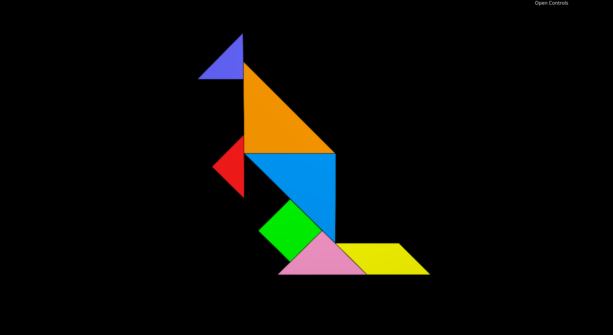
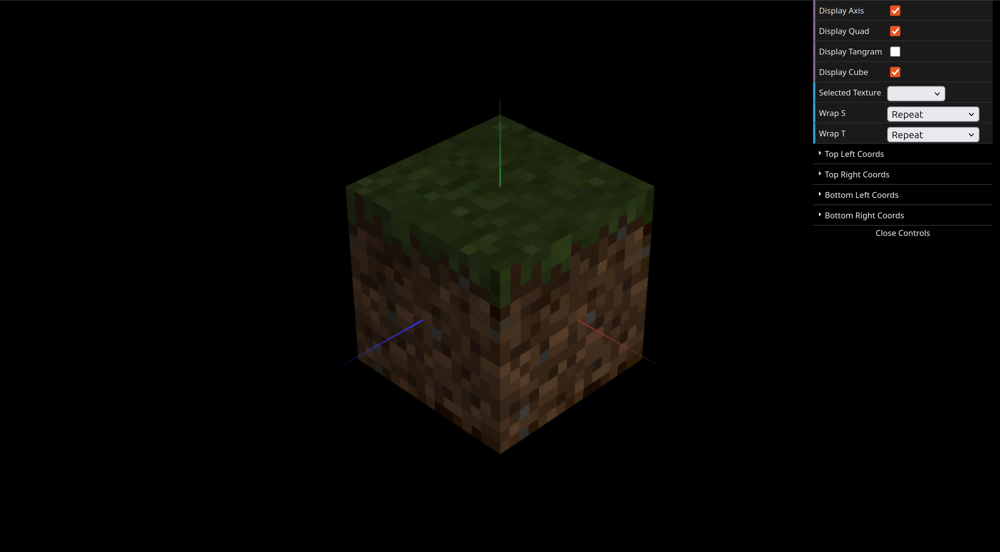

# CG 2024/2025

## Group T04G09

## TP 4 Notes

- In these exercises, we had some difficulties understanding how to properly apply the textures to the correct coordinates on specific faces and figures. However, through research and trial and error, we ultimately learned how to do it.

- Specifically in exercise 1, we had to pass the coordinates in the constructor for both the small and large triangles, since there was more than one instance of each.

