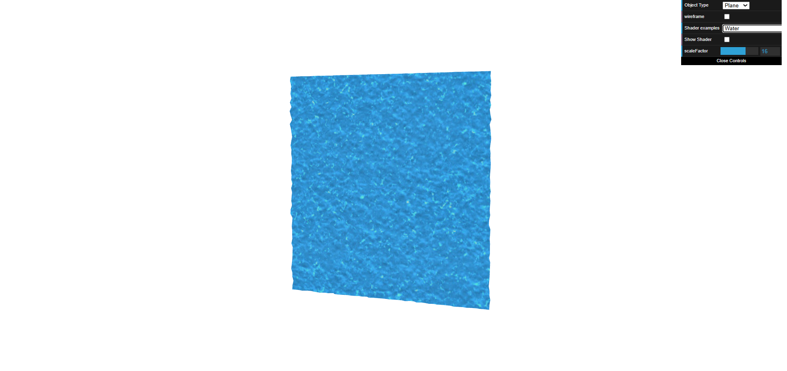

# CG 2024/2025

## Group T04G09

## TP 5 Notes

- In exercise 1, we took some time to understand how to use the update(t) and setUpdatePeriod() properly.

- In exercise 2, animating the texture coordinates to simulate the water flow was a trial and error process until the effect looked good and natural.

